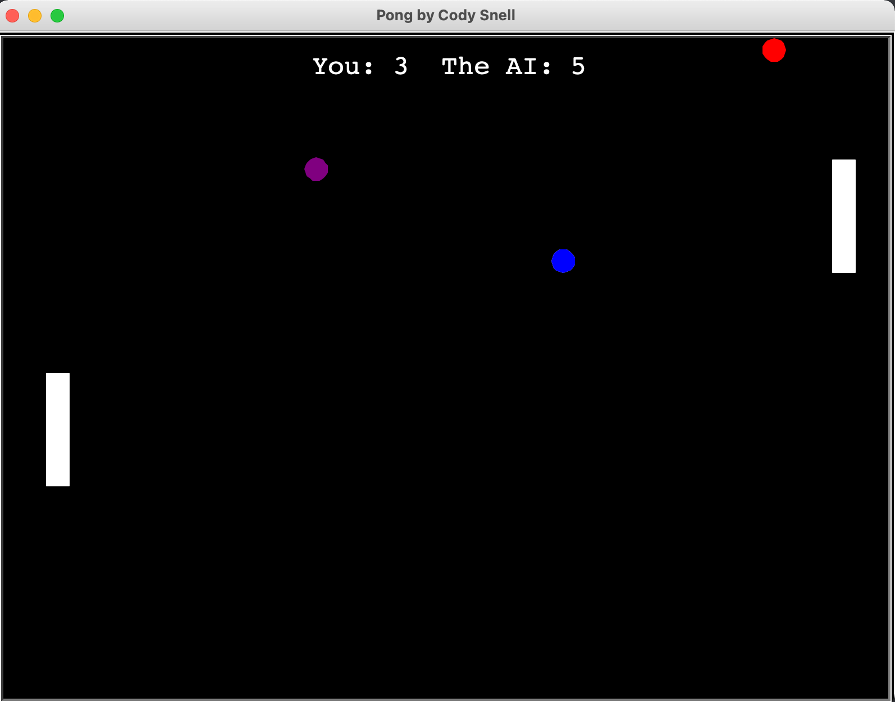
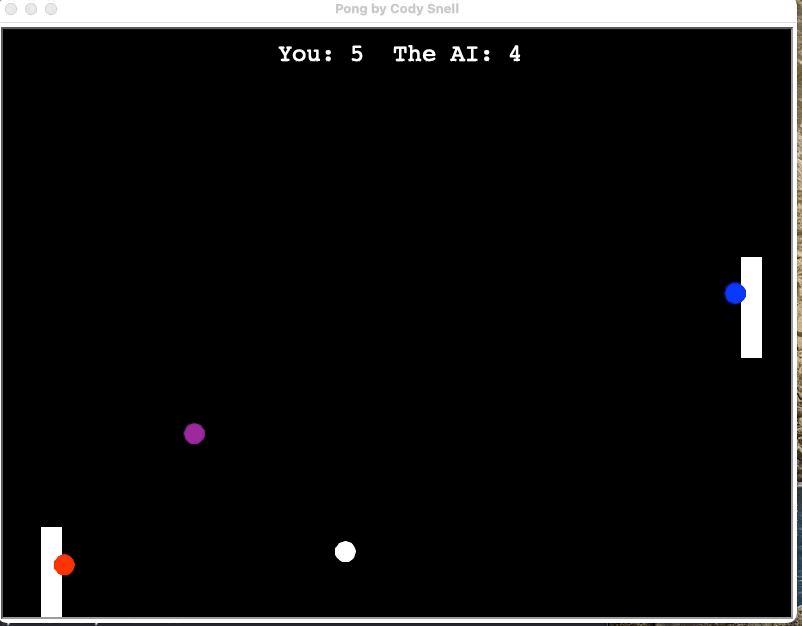

# Pong

This repository contains python based interactive Pong game.

## Running Pong:

```
git clone https://github.com/Decibullz/python-pong.git
cd python-pong
python pong.py
```

## Screenshots
<p align="center">



</p>

## Controls
1. Game auto starts
2. Up arrow or "w" to move left paddle Up
3. Down arrow or "s" to move left paddle Down
4. A track of player score is maintained
5. Game ends at 10 points
6. Game Auto restarts after 5 seconds


## Author
Cody Snell